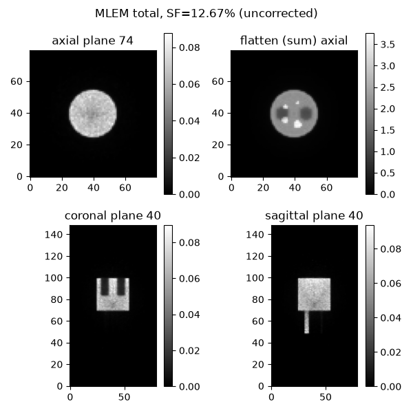
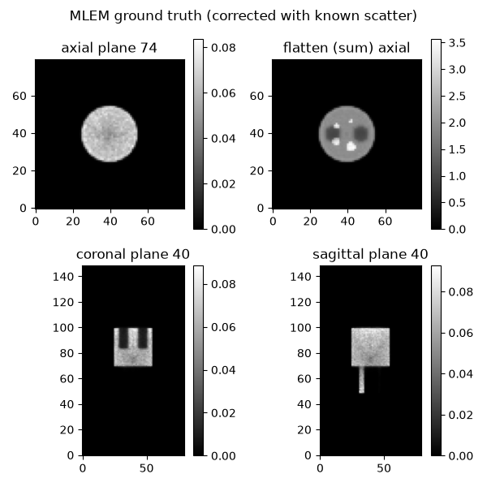
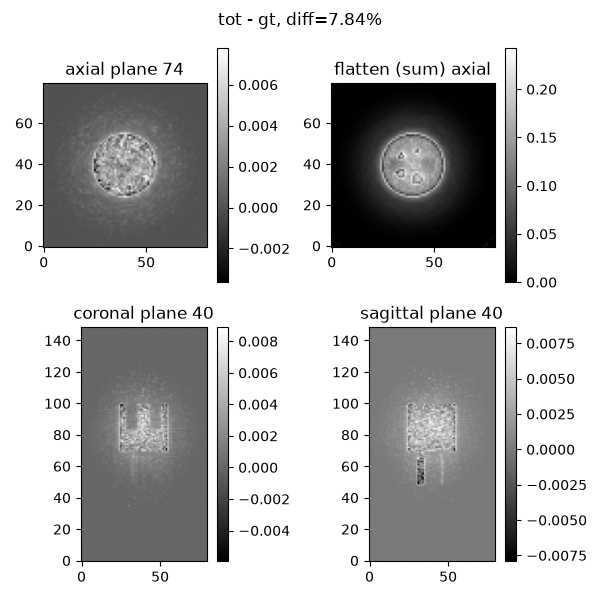

# A Reconstruction Tool for the MCGPU-PET Monte Carlo PET simulator

### Usage

This project depends on [Parallelproj](https://parallelproj.readthedocs.io/en/stable/), which has complex, non-Python dependencies. Personally, I preferred to use [pixi](https://pixi.prefix.dev/latest/) (instead of conda) to manage my environment. To use this tool, simply
```bash
git clone https://github.com/electronics10/mcgpu-recon.git
cd mcgpu-recon
pixi install
```

Then run the below example.

## Example

### 1 Prerequisite: a simple simulation result

```Python
import mcgpu_pet_wrapper as mpw
from pathlib import Path

run_dir = Path("data/run_0")
cfg = mpw.default_config()
cfg["sinogram"]["span"] = 1
mpw.validate_config(cfg)
voxel_space = mpw.nema_iq_preclinical(cfg, hot_activity_Bq_per_mL=200000)
mpw.build_run(run_dir, cfg, voxel_space)
simulation = mpw.Runner()(run_dir, "overwrite")
```

### 2 Reconstruction (MLEM)

```Python
from pathlib import Path
import numpy as np
import array_api_compat.cupy as xp # GPU; use `import numpy as xp` for CPU

import mcgpu_pet_wrapper as mpw
from mcgpu_recon import (from_run, mlem, attenuation_factors,
                         attenuation_map_from_vox, scale_match)
from mcgpu_recon.metrics import object_bbox, evaluate_recon
from mcgpu_recon.draw_tools import plot3Dimage


XP_KW = dict(xp=xp, plane_chunk=256)
run_dir = Path("data/run_0")
cfg = mpw.load_config(run_dir / "config.json")
plot3Dimage(mpw.read_emission_image(run_dir, cfg), run_dir/"recon_img/emission.png", "Emission")

# --- attenuation map straight from the simulation's own voxel grid ---------
# mass attenuation coefficients at 511 keV (cm^2/g) per material id; look these
# up for YOUR material list (NIST XCOM). ~0.096 for soft tissue is a fine start.
MU_RHO = {1: 0.087, 2: 0.096, 3: 0.094, 4: 0.093}   # air, water, adipose, spongiosa
vg = mpw.read_vox(run_dir, cfg)
mu_per_mm = attenuation_map_from_vox(vg, MU_RHO)

# --- measured data + attenuation factors -----------------------------------
y,   A = from_run(run_dir, cfg, **XP_KW)                # trues
y_s, _ = from_run(run_dir, cfg, scatter=True, **XP_KW)  # true scatter
y, y_s = xp.asarray(y), xp.asarray(y_s)
sf = float(y_s.sum() / (y_s.sum() + y.sum()))
af = attenuation_factors(A, xp.asarray(mu_per_mm))   # pass as mlem(mult=...)

NIT, FLOOR = 23, 0.07
# reference (target) + the two arms, ALL with identical recon settings
x      = mlem(A, y,       n_iter=NIT, mult=af, sens_floor_frac=FLOOR, verbose=True)  # trues ref
x_tot  = mlem(A, y + y_s, n_iter=NIT, mult=af, sens_floor_frac=FLOOR, verbose=True)  # no correction
x_gt   = mlem(A, y + y_s, n_iter=NIT, mult=af, sens_floor_frac=FLOOR, verbose=True, 
              contamination=y_s)                                                     # exact scatter

plot3Dimage(xp.asnumpy(x),     run_dir/"recon_img/mlem_trues_only.png", "MLEM trues only")
plot3Dimage(xp.asnumpy(x_tot), run_dir/"recon_img/mlem_tot.png",       f"MLEM total, SF={sf*100:.2f}% (uncorrected)")
plot3Dimage(xp.asnumpy(x_gt),  run_dir/"recon_img/mlem_gt.png",         "MLEM ground truth (corrected with known scatter)")

# --- residual images ------------------------------------------
x_gt_m, _ = scale_match(x, x_gt)
df = float(xp.linalg.norm(x_gt_m - x) / xp.linalg.norm(x))
plot3Dimage(xp.asnumpy(x_gt_m - x), run_dir/"recon_img/residual_gt.png", f"gt - trues only (scale-matched), diff={df*100:.2f}%")

df = float(xp.linalg.norm(x_tot - x_gt) / xp.linalg.norm(x_gt))
plot3Dimage(xp.asnumpy(x_tot - x_gt), run_dir/"recon_img/residual_tot.png", f"tot - gt, diff={df*100:.2f}%")

# --- quantitative metrics --------------------------------------
bbox = object_bbox(np.asarray(vg.activity) > 0)

print(f"{'arm':8s} {'PSNR':>7s} {'SSIM':>7s}")
m = evaluate_recon(xp.asnumpy(x_tot), xp.asnumpy(x_gt), bbox=bbox)
print(f"{"floor":8s} {m['psnr']:7.2f} {m['ssim']:7.3f}")
```

 


## Package (Developer)

It is a little more complex to use it as a package directly (since the repo isn't released in conda-forge). One can try to paste the following toml text into the `pixi.toml` in there own project. First, create your own project if not yet created.

```bash
mkdir my-project
cd my-project
```

Then, initiallize pixi and intall Python>=3.12.
```bash
pixi init
pixi add python=3.12
```

You will see a file `pixi.toml` in your directory. Open it with a text editor and replace it with the following:
```toml
[workspace]
name = "my-project"
channels = ["conda-forge"]
platforms = ["linux-64"]

[dependencies]
python = "3.12.*"
parallelproj = ">=1.10.2,<2"
cupy = ">=14.1.1,<15"
cuda-version = "12.*"
scikit-image = ">=0.26.0,<0.27"
matplotlib = ">=3.11.0,<4"

[system-requirements]
cuda = "12"

[pypi-dependencies]
mcgpu-recon = { git = "https://github.com/electronics10/mcgpu-recon.git" }
```

(Change the name and system requirements according to your own setup. The dependency [mcgpu-pet-wrapper](https://github.com/electronics10/mcgpu-pet-wrapper.git), my another project/package, is NOT machine agnostic, check it out if you encounter any installation problem.)

Finally, enter
```bash
pixi install
```

and pixi will install everything in the environment.